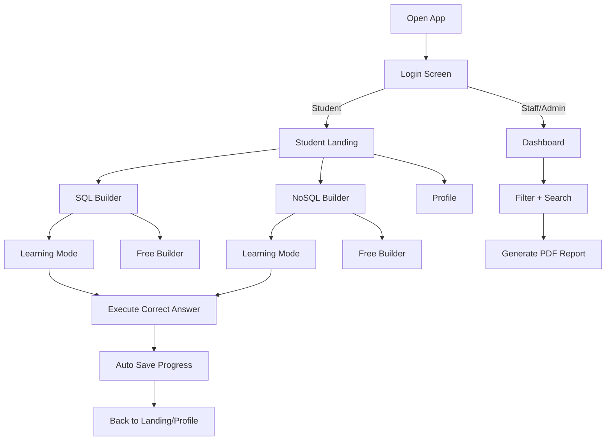

# DualDB Query Architect — User Flow

Last updated: February 22, 2026

This document describes the end-to-end user flow for each role (Student / Staff / Admin), including login, learning, progress tracking, dashboards, reports, and certificates.

---

## 1) Roles and what they can do

### Student
- Learn SQL and NoSQL using blocks.
- Use **Free Builder** or **Learning Mode**.
- Progress is saved automatically.
- View profile progress and download certificates after completing 100%.

### Staff (HOD / Faculty)
- View dashboard analytics for **their assigned year + section**.
- Search students by name or roll number.
- Generate and download a PDF report for their class.

### Admin
- View dashboard analytics for **any year + section**.
- Search students by name or roll number.
- Generate and download a PDF report for the selected year + section.

---

## 2) High-level navigation flow

---

## 3) Login flow (role-based)

### 3.1 Common login steps
1. User opens the app.
2. The login screen shows role selection: **Student / Staff / Admin**.
3. On successful login, a JWT token is stored in `localStorage` (`qa_auth`).
4. On refresh/re-open, the app calls `/api/auth/me` using the stored token to restore the session.

### 3.2 Student login
- Inputs:
  - Name
  - Roll Number
  - Year
  - Section
- System behavior:
  - The student must exist in the allowlist (`src/data/auth.json`).
  - A token is issued and the user is routed to **Student Landing**.

### 3.3 Staff login
- Inputs:
  - Staff Name
  - Staff Email
- System behavior:
  - The staff member must exist in the allowlist (`src/data/auth.json`).
  - The staff’s assigned year/section is loaded and enforced for dashboards.
  - A token is issued and the user is routed to the **Dashboard**.

### 3.4 Admin login
- Inputs:
  - Admin Email
  - Admin Password
- System behavior:
  - Credentials must match the allowlist admin entry (`src/data/auth.json`).
  - A token is issued and the user is routed to the **Dashboard**.

---

## 4) Student flow

### 4.1 Landing page
After login, the student sees:
- **SQL Builder** card
- **NoSQL Builder** card
- Top-right actions:
  - Theme toggle (Light/Dark)
  - My Profile
  - Logout

### 4.2 Choose SQL or NoSQL
1. Student clicks **SQL Builder** or **NoSQL Builder**.
2. The app initializes the environment (cloud DB where applicable).
3. Student enters the selected builder.

### 4.3 Free Builder mode
- Student can assemble blocks and execute queries.
- This mode is exploratory and does not require passing a question validation.

### 4.4 Learning Mode
- The student sees:
  - Level map (left)
  - Workspace (center)
  - Generated query + results (right)
- When the student executes a valid/correct solution:
  - Score increases
  - The question is marked completed
  - Levels unlock progressively
  - **Progress is synced to the backend automatically**

### 4.5 Progress auto-save
- On each correct answer in Learning Mode, the frontend sends:
  - `POST /api/user/progress` with `Authorization: Bearer <token>`
  - `dbType` (`SQL` or `NoSQL`)
  - `progress` payload containing completed questions/levels and score

### 4.6 Profile & certificate
- Student opens **My Profile** from Landing.
- Profile displays SQL and NoSQL progress.
- Certificate rules:
  - Certificate becomes available after completing **100%** of that track.
  - Certificate includes the HOD signature image above the HOD line.

---

## 5) Staff/Admin dashboard flow

### 5.1 Dashboard overview
Dashboard shows:
- Summary cards per section (A/B/C)
- Top student per section
- Student progress table (SQL Done, NoSQL Done, Total)

### 5.2 Filters
- Staff:
  - Section and year are **enforced from staff profile** (cannot view other classes).
- Admin:
  - Can filter by:
    - **Year**
    - **Section**

### 5.3 Search
- Search input filters the table by:
  - Student name (partial match)
  - Roll number (partial match)

### 5.4 Report generation (PDF)
- Staff:
  - Generates report for their own class scope.
- Admin:
  - Generates report for the selected **Year + Section**.

Report includes:
- Total students
- Students who completed at least 1 question
- Average completion
- Top performers

---

## 6) Theme mode flow

- Theme toggle is available on:
  - Login
  - Student Landing
  - Staff/Admin Dashboard
- Theme preference is stored in `localStorage` under `qa_theme`.
- Builder screens run in dark theme for consistent editor readability.

---

## 7) Notes for deployment/testing

- If the backend is restarted while using JSON allowlist mode, in-memory progress may reset (because progress is stored in server memory for JSON-auth users).
- If you want progress to persist across backend restarts, the backend would need to store progress in a database/file instead of memory.
